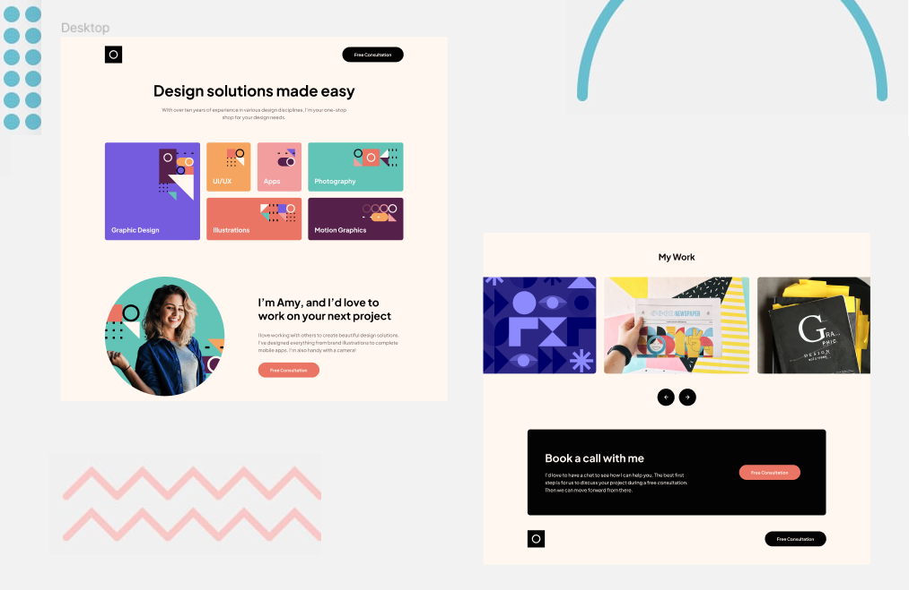

# Frontend Mentor - Single-page-design-portfolio

This is a solution to the [Single-page-design-portfolio]

## Table of contents
  - [Interaction](#interaction)
  - [Screenshot](#screenshot)
  - [Links](#links)
  - [Challenge](#challenge)
  - [Built with](#built-with)
  - [Author](#author)

### interaction
Users should be able to:

Users should be able to:

View the optimal layout for the app depending on their device's screen size
See hover states for all interactive elements on the page
Navigate the slider using either their mouse.

### Links

- Solution URL: [Add solution URL here](https://github.com/DavitDvalashvili/Single-page-design-portfolio)
- Live Site URL: [Add live site URL here](https://davitdvalashvili.github.io/Single-page-design-portfolio/)

### Built with

- CSS custom properties
- Semantic HTML5 markup
- Flex property
- grid
- Media queries for responsive website
- Mobile-first workflow
- javascript

## Author

- Github profile - [Add your name here](https://github.com/DavitDvalashvili)
- Linkedin profile - [Add your name here](https://www.linkedin.com/in/davit-dvalashvili-0421b6253)
- Email - [@your_username](davitdvalashvili1996@gmail.com)

